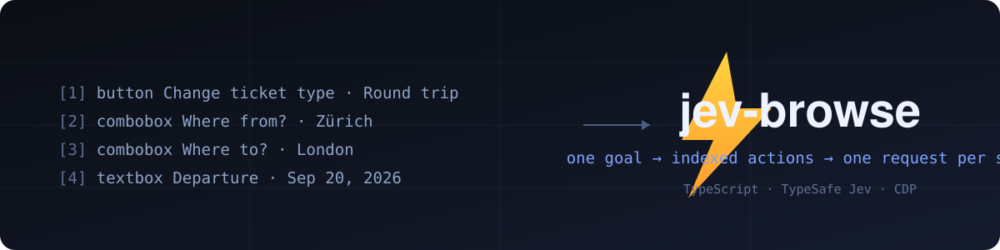
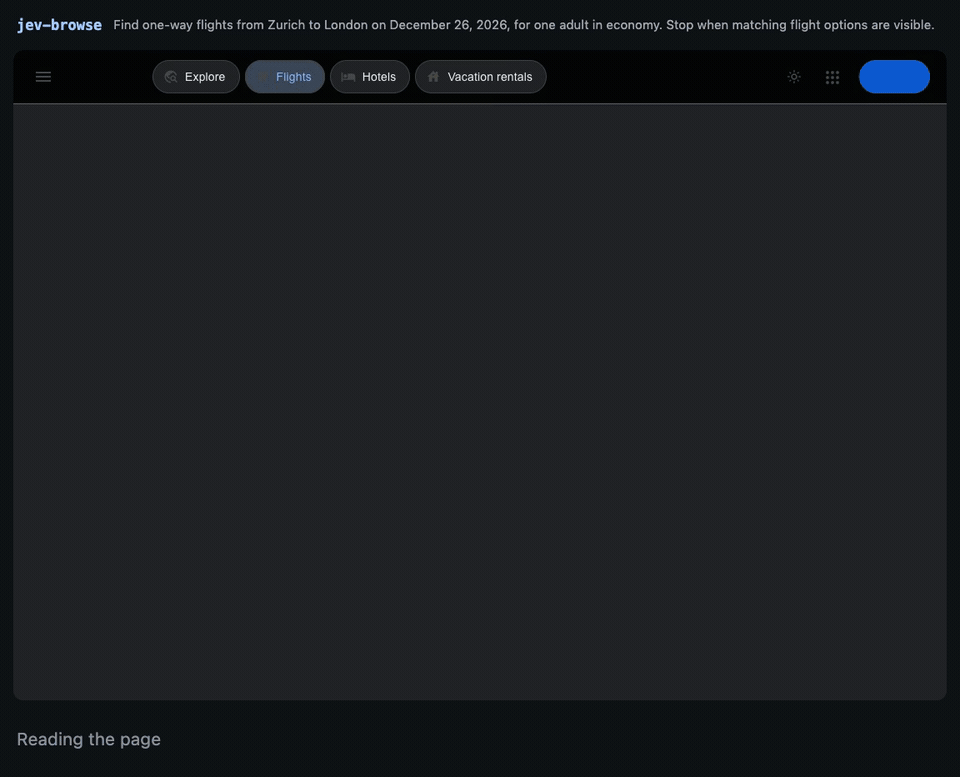

# jev-browse

You give jev-browse a goal and a start URL, and it drives Chrome until the goal
is done or it's stuck. On each step, [TypeSafe's Jev](https://docs.typesafe.ai)
reads a numbered table of what's on the page and picks one operation and one
row. It never writes selectors, coordinates, or code, so every target it can
name exists. A small LLM only runs for `TYPE_TEXT`, to write the text.

Here it searches Google Flights for one-way flights from Zürich to London, at
real speed. The bar at the bottom captions each action as it runs.

[](docs/demo.mp4)

[MP4](docs/demo.mp4) · [The run loop](src/agent.ts) · [The recorder](scripts/record_demo.mjs)

That run took 14,586 ms and 11 actions, counted from the first page
observation, model calls and page loads included. It ends on a CHF results page
for Saturday, December 26, 2026. The video is timed from CDP frame timestamps
and holds the last frame for 2.5 seconds.

## Install

You need Node 22 or later and Chrome. The repo root is an
[Agent Plugins](https://agent-plugins.org/) package (`plugin.json`, `mcp.json`,
`skills/`), so each harness installs it its usual way:

| Harness | Install |
| --- | --- |
| Pi | `pi install git:github.com/0x7067/jev-browse` (registers the `jev_browse` tool and skill) |
| Claude Code | `claude plugin marketplace add 0x7067/jev-browse`, then `claude plugin install jev-browse@jev-browse` |
| Codex / ChatGPT | `codex plugin marketplace add 0x7067/jev-browse`, then `codex plugin install jev-browse` |
| OpenCode | `opencode plugin add github:0x7067/jev-browse` (native `jev_browse` tool, so remove any `jev` MCP entry) |
| Any MCP client | stdio command `npx -y -p github:0x7067/jev-browse jev-browse-mcp` |
| CLI only | `npm install -g github:0x7067/jev-browse`, or `npx -y -p github:0x7067/jev-browse jev-browse` |

All of these run `bundled/`, a committed esbuild bundle with the SDK inlined.
Nothing gets built or `npm install`ed on your machine.

```bash
JEV_PROVIDER=...            # typesafe or openrouter; defaults to openrouter when its key is set
TYPESAFE_API_KEY=...        # console.typesafe.ai/settings/keys
OPENROUTER_API_KEY=...      # openrouter.ai/settings/keys
TYPESAFE_MODEL=jev-latest   # default
TEXT_MODEL_API_KEY=...      # needed for TYPE_TEXT and written answers
TEXT_MODEL_BASE_URL=...     # any OpenAI-compatible endpoint
TEXT_MODEL=...              # e.g. inception/mercury-2.5 on OpenRouter
ANSWER_REVIEW_MODEL=...     # optional; defaults to anthropic/claude-opus-5.5 on OpenRouter, else TEXT_MODEL
JEV_AB_PROFILE=...          # optional agent-browser profile dir (default ~/.jev-browse/agent-browser-profile)
```

Keys come from the environment first, then `.env` in the package root, then the
client's plugin-data directory (`PLUGIN_DATA` or `CLAUDE_PLUGIN_DATA`), then
`.env` in the current directory. The plugin-data lookup exists because MCP
servers started by a GUI app don't inherit your login shell. `.env.example`
lists every variable.

## Run it

```bash
jev-browse --url https://www.google.com/travel/flights?hl=en \
  --goal "Find one-way flights from Zurich to London on December 26, 2026, \
for one adult in economy. Stop when matching flight options are visible." \
  [--engine cdp|agent-browser] [--headed] [--cdp http://localhost:9222] \
  [--max-steps 60] [--expect JSON] [--stop-at-challenge] [--trace FILE]
```

Step events stream to stderr as JSONL, and stdout gets only the final result
JSON. Exit code 0 means `done`, 2 means `blocked`, 1 means error.

The MCP server (`node bundled/mcp.mjs`, stdio) exposes one tool, `jev_browse`,
with the same inputs. The OpenCode plugin registers that tool natively and runs
the bundle in a `node` subprocess, because OpenCode's sandbox can't import files
outside the plugin directory. If you'd rather use MCP there:
`opencode mcp add jev --global -- npx -y -p github:0x7067/jev-browse jev-browse-mcp`.

Start URLs must be `http` or `https`. Page text goes to outside model APIs, and
a `file://` URL would send your local files with it. Tests opt in with
`--allow-file-urls` or `JEV_ALLOW_FILE_URLS=1`.

## What the model sees

Every observation builds a fresh table:

```
[1] button    Change ticket type · Round trip
[2] combobox  Where from?        · San Francisco
[3] combobox  Where to?          · empty
[4] textbox   Departure          · empty
...
```

The operations are `CLICK`, `DOUBLE_CLICK`, `TYPE_TEXT`, `SELECT`,
`SCROLL_UP`, `SCROLL_DOWN`, `WAIT`, `DONE`, `BLOCKED`, `HOVER`,
`CONTEXT_CLICK`, `DRAG`, `GO_BACK`, `GO_FORWARD`, and `PRESS_*` for Enter, Tab,
Escape, Backspace, Delete, the arrows, Home, End, PageUp, PageDown, and Space.
Key presses are real key events, so Enter-to-submit forms and command palettes
work.

One Jev request answers the operation and every target question together
(`click_target`, `type_text_target`, `select_target`). The agent uses whichever
target matches the operation and ignores the rest, so a decision is one round
trip. Jev also predicts the likely next move, like picking the autocomplete
suggestion after typing. If the page afterwards matches, the agent runs it
without asking again. That's the `FOLLOW_UP` caption in the demo.

Nothing looks at screenshots. `snapshot.js` collects visible controls, their
names and values, and the page text in one browser call, and keeps references to
the real DOM nodes. It reads through open shadow roots and same-origin iframes,
adding up frame offsets so clicks land on the right pixel. It indexes
`password`, `date`, `time`, `range`, and `file` inputs that a plain role
mapping misses. Dates are typed key by key, since `insertText` can't fill them.
Files go in through `DOM.setFileInputFiles` and are never clicked. When a click
opens a tab, the agent follows it.

Where the platform has a standard signal, the snapshot uses it: ARIA IDL
reflection, `computedRole()` and `computedName()` when the browser has them,
the HTML-AAM implicit roles, native `<dialog>` and ARIA modals, and `rel`/`href`
tokens copied verbatim. Heuristics fill only the gaps, and
[docs/standards.md](docs/standards.md) lists each one with its reason.

## Acting safely

Before acting, the agent checks the page hasn't changed since it looked. Fill
and `DONE` compare the whole page marker. Click and select compare the document,
URL, form values, and the area around the target. Scrolls and waits that don't
name an element skip the check, because on an infinite scroll or a live feed the
page is always moving and the action is still valid. A ticking clock, a counter,
or a re-render that swaps every node doesn't count as a change. If a node was
swapped out, the agent finds it again once by root, role, and name.

Actions that change the page never retry, with one exception. Sometimes trusted
`Input.dispatch*` events never reach the page, for instance after a cancelled
navigation kills the renderer's input pipeline. Then a click or hover retries
once through in-page events before it counts as a strike. `TYPE_TEXT` values are
cached only while the helper's input stays identical.

A run ends `blocked` after `--max-steps` actions (default 60), after twice that
many model calls, after three non-wait actions in a row that change nothing, or
after 10 seconds without progress. Other fuses catch loops and repeated page
states. Each browser profile has one run lock under `~/.jev-browse/`, and a
second run on the same profile waits 30 seconds and then fails rather than fight
over Chrome's SingletonLock.

As root, Chrome won't start without `--no-sandbox`, so jev-browse adds it and
says so on stderr. To keep renderer sandboxing, attach to a Chrome running as a
normal user with `--cdp` or `JEV_CDP_URL`. `JEV_CHROME_ARGS` adds your own
flags, split like a shell would.

## Deciding it's done

`DONE` is a claim, and the model has made false ones. We caught it claiming
success on command palettes that only accept Enter. So every `DONE`, including a
predicted one, is checked against a fresh observation.

With `--expect`, you supply regexes (`url_match`, `text_match`, `state_match`,
`frames_match`) and all of them must match. That replaces the model's judgment,
so list every outcome you care about:

```bash
node bundled/cli.mjs --url https://example.com --goal 'Read the example page' \
  --expect '{"text_match":"Example Domain"}'
```

Without it, a separate review decides whether the goal is satisfied,
incomplete, or uncertain, and what the evidence is: the current page, earlier
observations, or an action the goal named as the stopping point. The agent keeps
up to eight observations. When it has to drop one, it drops the one whose text
the others already cover, so a chapter read ten scrolls ago survives. A
decision that says the goal is already met only overrides the chosen action when
it's confident about it.

When the goal asks for information, the answer is written from those
observations and then reviewed by `ANSWER_REVIEW_MODEL` before it's returned.
The reviewer sees the same page text and control labels the writer saw, so a
price that only appears on a button ("New (2) from $42.99") still counts as
evidence. If the completion review is unsure, the answer reviewer gets the final
say. Two rejected claims on the same page end as `blocked/completion_unverified`
or `blocked/answer_unverified`. All of this is model judgment. Check outcomes
that matter yourself.

On a visible CAPTCHA or verification page, the agent gets two actions (a
checkbox, a press-and-hold). If the challenge is still there after that, it stops
with `blocked/verification_required`. Pass `--stop-at-challenge`, or say so in
the goal, to stop at the first sight of one. Hidden widget markup doesn't count.

## Engines

| | `cdp` (default) | `agent-browser` |
| --- | --- | --- |
| Transport | Minimal CDP client over a browser WebSocket | `agent-browser` CLI subprocesses |
| Browser | Launches Chrome with a persistent `~/.jev-browse/profile`, or attaches with `--cdp` | Managed session, `~/.jev-browse/agent-browser-profile` |
| Input | `Input.dispatchMouseEvent`, `insertText`, key events | CLI click/fill/select/hover on tagged `data-jev-node` elements |
| Needs | Chrome | the agent-browser binary |

Both implement `BrowserDriver` (`observe / fresh / act / close`) over the same
`snapshot.js`, action space, and freshness contract. Agent-browser can't send a
real double-click (its `dblclick` emitted one click in testing), so it
dispatches synthetic pointer events and `dblclick`, which have
`isTrusted=false`. File uploads inside shadow roots or frames aren't verified on
either engine.

## How well it works

The fixture suite ([`evals/tasks.json`](evals/), 101 tasks) covers forms,
autocomplete, iframes, shadow roots, hover menus, selects, date pickers, file
upload, modals, multi-tab flows, infinite scroll, drag and drop, context menus,
invisible custom controls, and logged-in flows like ParaBank transfers and
saucedemo checkouts. Every task is checked against the final URL, page text, or
executed actions, never against the agent's own `DONE`. On the current build a
full pass verified 95 on `cdp` and 94 on `agent-browser`. Most of the misses are
live sites that fail on and off between runs (tin-hovers, mdn-search,
europa-consent, demoqa-autocomplete).

The open web is harder. On a 30-task WebVoyager pilot with an external judge,
12 were verified on an earlier build. Single live runs move by about two tasks
either way, so compare builds on repeated runs. The recurring failures aren't
clicks. Some sites put up bot walls (Cambridge Dictionary, Allrecipes), and
some tasks need evidence the page never shows, like which bus stop is nearest
when Google Maps gives no distances. [evals/webvoyager/HANDOFF.md](evals/webvoyager/HANDOFF.md)
has the per-task record.

Things it can't do: cross-origin iframes and closed shadow roots stay opaque,
because the DOM doesn't expose them. There's no address bar in the action
space, so start on the right site (Google Flights, not google.com). Nothing in
the code stops purchases or credential entry. The instructions ask the model to
behave and nothing enforces it, so scope goals accordingly.

## Traces

`--trace FILE` (or `JEV_TRACE_FILE`) writes a local JSONL trace. The path must
be new, the file is owner-only, and nothing is uploaded. It holds page text, DOM
targets, model inputs and outputs, and may hold typed values.

```bash
node bundled/cli.mjs --url https://example.com --goal 'Read the page' \
  --trace evals/results/read-example.jsonl
node scripts/trace-summary.mjs evals/results/read-example.jsonl
node scripts/eval.mjs --tasks fx-quiz-setup,fx-guide-anchor --trace
```

Both engines record observations, decisions, attempted actions, DOM fallbacks,
completion checks, and fatal snapshots. CDP traces add request and session IDs,
method timing, and navigation failures. A call still pending after five seconds
triggers one `Browser.getVersion` liveness probe, and errors name the stalled
method, session, and call ID.

The result's `final_frames` reports each visible frame's declared source,
readable URL, ready state, and any `data-loaded`/`data-ready` attribute.
`load_event: unknown` means the observer didn't see one, not that the frame
failed.

## Code map

Every implementation file stays under 500 lines, and `npm run lint` enforces it.

| File | Job |
| --- | --- |
| [src/agent.ts](src/agent.ts) | Run loop, state, result assembly |
| [src/agent/steps.ts](src/agent/steps.ts) | Phase machine: observe, decide, act, settle |
| [src/agent/completion.ts](src/agent/completion.ts) | Completion review and answer gating |
| [src/agent/answer.ts](src/agent/answer.ts) | Answer generation and evidence review |
| [src/agent/progress.ts](src/agent/progress.ts) | Observation history and retention |
| [src/agent/consults.ts](src/agent/consults.ts) | DONE confirmation, blocked probes, repairs |
| [src/agent/fuses.ts](src/agent/fuses.ts) | Cycle, revisit, and idle fuses |
| [src/agent/followup.ts](src/agent/followup.ts) | Predicted follow-ups |
| [src/snapshot/](src/snapshot/) → [src/snapshot.js](src/snapshot.js) | Fragments joined into the injected snapshot |
| [src/model/decide.ts](src/model/decide.ts) | The decision request |
| [src/model/space.ts](src/model/space.ts) | The numbered action space |
| [src/model/text.ts](src/model/text.ts) | Text helper for `TYPE_TEXT` and answers |
| [src/questions.ts](src/questions.ts) | Model instructions |
| [src/cdp/](src/cdp/) | CDP engine: session, input, events, freshness, launch |
| [src/abrowser.ts](src/abrowser.ts) | agent-browser engine |
| [src/cli.ts](src/cli.ts) · [src/mcp.ts](src/mcp.ts) | CLI entry point and stdio MCP server |
| [integrations/](integrations/) | Pi extension and OpenCode plugin |
| [bundled/](bundled/) | Committed bundles that installs run |
| [scripts/eval.mjs](scripts/eval.mjs) · [evals/](evals/) | Task suites and results |

## Development

```bash
git clone https://github.com/0x7067/jev-browse && cd jev-browse
npm install          # dev tooling only
npm run typecheck
npm run lint         # oxlint, the 500-line cap, and the no-comments check
npm run compile      # builds src/snapshot.js, dist/, and bundled/
npm run check:bundle # fails if bundled/ differs from the commit
npm run run -- --url ... --goal ...   # tsx src/cli.ts, no build
```

Commit the rebuilt `bundled/` with any change to `src/`, since installed copies
run nothing else. The build script is called `compile` on purpose. If a script
named `build`, `install`, or `prepare` exists, npm runs it when installing from
git, and that breaks `npx -p github:...`.

To re-record the demo (live runs make paid API calls):

```bash
node scripts/record_demo.mjs --url "https://www.google.com/travel/flights?hl=en&curr=CHF" \
  --goal "Find one-way flights from Zurich to London on {{DATE+90d}}, \
for one adult in economy. Stop when matching flight options are visible."
```

`{{DATE+Nd}}` resolves to N days after today. Don't hard-code the date. Once it's
past, Google Flights greys it out and the run ends on a false `DONE` in the
calendar.

## License

MIT. See [LICENSE](LICENSE).
